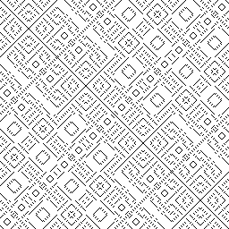
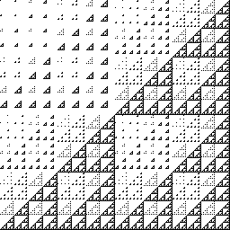

# bitgrid

## 介绍

使用Rust来生成艺术图形

## (x ^ y) % 9

```rust
use image::{DynamicImage, Rgb, RgbImage};

fn main() {
    let mut img = RgbImage::new(256, 256);
    for y in 0..256 {
        for x in 0..256 {
            let val = (x ^ y) % 9;
            let val = (x | y) % 17;

            if val > 0 {
                img.put_pixel(x, y, Rgb([255, 255, 255]));
            }
        }
    }
    let img: DynamicImage = DynamicImage::ImageRgb8(img);
    img.save("hello.png").unwrap();
}
```



## (x | y) % 17

```rust
use image::{DynamicImage, Rgb, RgbImage};

fn main() {
    let mut img = RgbImage::new(256, 256);
    for y in 0..256 {
        for x in 0..256 {
            let val = (x | y) % 17;

            if val > 0 {
                img.put_pixel(x, y, Rgb([255, 255, 255]));
            }
        }
    }
    let img: DynamicImage = DynamicImage::ImageRgb8(img);
    img.save("hello.png").unwrap();
}
```



## 使用方法

直接运行程序即可，程序会输出表达式，并将最终生成的图片保存在当前文件夹中

```shell
cargo run
```

